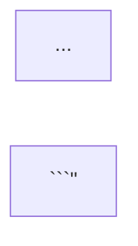

# Flowchart Generator — 流程图生成 Skill

## Overview

This skill generates beautiful flow diagrams from either input form:

| Input | Action |
|-------|--------|
| **自然语言描述** | LLM 根据描述生成 Mermaid 代码 → 渲染为图片 |
| **Mermaid 语法**（带 ` ```mermaid ` 代码块） | 直接渲染为图片 |

Output is a high-quality PNG image of the diagram, plus the `.mmd` Mermaid source so the user can edit it.

## When to Use

**Use this skill when the user wants to:**
- 画一个流程图 / 画个时序图 / 画个架构图
- 把一段流程描述可视化为图
- 渲染已经写好的 Mermaid 代码
- 解释一个系统、协议、数据流向
- 对比两个环境（信任边界、网络边界）

**Triggers**: 流程图、flowchart、时序图、sequence、架构图、architecture、依赖关系、状态机、state machine、画图、绘图、画个图、可视化、Mermaid、流程描述、画出.

## How It Works

```
User input
    │
    ├── Detect: contains ```mermaid``` block?
    │       │
    │       ├── Yes → extract Mermaid code
    │       │
    │       └── No  → LLM generates Mermaid from natural language
    │                  (follows references/style-guide.md)
    │
    ↓
    Validated Mermaid code (.mmd)
    ↓
    scripts/render.sh → mmdc → output.png
    ↓
    present_files → user sees the diagram
```

## Quick Start

### Invocation patterns

```
# 1. Natural language
"画一个用户登录流程：用户输入用户名密码 → 提交到后端 → 后端校验 → 成功返回 JWT / 失败返回错误"

# 2. Direct Mermaid
"用 Mermaid 画一个 OAuth 授权流程：


## The Pipeline

### Step 1 — Detect input form
Look for a fenced ` ```mermaid ` block. If present, treat as direct Mermaid. Otherwise it's a natural-language request.

### Step 2 — Generate Mermaid (natural language only)
- Read `references/style-guide.md` first to load the visual style
- Translate the user's description into Mermaid `flowchart`, `sequenceDiagram`, `classDiagram`, `stateDiagram-v2`, or `erDiagram` as appropriate
- **Always start with `%%{init: {'flowchart': {'defaultRenderer': 'elk', 'padding': 30, 'nodeSpacing': 60}}}%% flowchart LR`** for flowcharts to get good horizontal layouts
- For diagrams with subgraphs, keep `padding: 30` in the init config (do not over-pad)
- Use white node fills + colored borders (`oaNode` / `cuNode`) and pastel subgraph backgrounds
- Embed numbered step badges as `<span class='badge'>N</span>` in edge labels
- Apply return-path labels as `<span class='return-text'>...</span>`
- For long edge labels that would touch a container, wrap the text in `<span style='display:inline-block;padding-right:40px;background:rgb(255,255,255);'>...</span>`

### Step 3 — Render
Run the render script:
```bash
bash ~/.workbuddy/skills/flowchart-generator/scripts/render.sh \
    --input flowchart.mmd \
    --output flowchart.png \
    --width 1800
```

The script:
- Detects the system Chrome installation (or bundled Chromium) for rendering
- Auto-loads `scripts/flowchart-theme.css` for the OpenAI-style look
- Runs `scripts/preprocess-mermaid.py` to inject inline badge styles and a small top padding on subgraph titles
- Calls `mmdc` (Mermaid CLI) to render the PNG
- Produces PNG and keeps the `.mmd` source

### Step 4 — Present
Call `present_files` with the PNG path so the user sees the diagram. Also keep the `.mmd` source for reuse.

## File Map

| File | Purpose |
|------|---------|
| `SKILL.md` | This file — skill entry point |
| `scripts/render.sh` | Render Mermaid → PNG |
| `scripts/install.sh` | Install mmdc dependencies |
| `scripts/llm-to-mermaid.md` | Prompt guide for NL→Mermaid |
| `scripts/flowchart-theme.css` | Custom CSS theme (badges, shadows, arrow colors, fonts) |
| `scripts/preprocess-mermaid.py` | Injects inline badge styles and subgraph-title padding before rendering |
| `scripts/puppeteer-config.json` | Uses system Google Chrome for rendering |
| `references/style-guide.md` | Visual style rules (colors, shapes, layout, ELK) |
| `references/mermaid-cheatsheet.md` | Mermaid syntax quick reference |
| `templates/horizontal-flow.md` | Reusable template: horizontal flow |
| `templates/architecture.md` | Reusable template: trust boundaries |
| `templates/three-columns.md` | Reusable template: three-column comparison |
| `examples/*.md` | Working examples |

## Choosing the Right Diagram Type

| User describes… | Use |
|-----------------|-----|
| Steps in a process, decisions, branches | `flowchart LR` |
| Actors calling each other, time order | `sequenceDiagram` |
| Classes / entities with relations | `classDiagram` |
| States and transitions | `stateDiagram-v2` |
| DB tables and relationships | `erDiagram` |
| Git history / project timeline | `gitGraph` |

Default to `flowchart LR` unless the user clearly wants something else.

## Output Quality

The renderer uses:
- **Mermaid CLI** (`@mermaid-js/mermaid-cli`) — the official Mermaid renderer
- **ELK layout engine** (`defaultRenderer: elk`) — produces clean left-to-right diagrams with subgraphs
- **Puppeteer / Google Chrome** — headless browser that runs Mermaid
- **Custom CSS theme** (`scripts/flowchart-theme.css`) — white nodes, soft borders, pastel group backgrounds, circular badges, colored arrows

For a result closest to the example images, follow `references/style-guide.md` (ELK layout, white nodes, blue/green dual-tone palette, `class='badge'` step circles).

## Installation

If `mmdc` is not available:
```bash
bash ~/.workbuddy/skills/flowchart-generator/scripts/install.sh
```

This installs `@mermaid-js/mermaid-cli` into the managed node workspace.

## Tips

1. **Always start with diagram type** (`flowchart LR` etc.) — Mermaid needs it
2. **Subgraphs** for trust boundaries, swimlanes, or grouping
3. **Numbered steps** — embed badges in edge labels: `-->|"<span class='badge'>1</span> label"|`
4. **Trust boundaries** — use `subgraph` + `style` for pastel group backgrounds
5. **Horizontal layout** — add `OpenAI ~~~ E ~~~ TS ~~~ Customer` invisible edges to keep order
6. **Don't use reserved words** as node IDs (e.g. `end`, `subgraph`)
7. **Test short Mermaid first** if the user wants quick iteration
8. **Keep diagrams readable** — break huge diagrams into 2-3 smaller ones

## Limitations

- Mermaid cannot perfectly replicate every custom diagram tool (e.g. Excalidraw, tldraw) — but it gets close with ELK + custom CSS
- **Return arrowheads** are all the same color (blue) because Mermaid shares one arrow marker across all edges
- **Background decorative circles / gradients** in the example images cannot be generated by Mermaid natively
- Very large diagrams (30+ nodes) can become cramped — split them
- Animated or interactive elements are not supported in static PNG output
- The example style is approximated via CSS, not pixel-identical to tools like Lucidchart / Figma

For pixel-identical output, consider extending this skill with D2 or a custom SVG renderer.

## See Also

- `references/style-guide.md` — visual style for matching the example aesthetic
- `references/mermaid-cheatsheet.md` — Mermaid syntax quick reference
- `templates/` — copy-paste starting points
- `examples/` — full working examples
