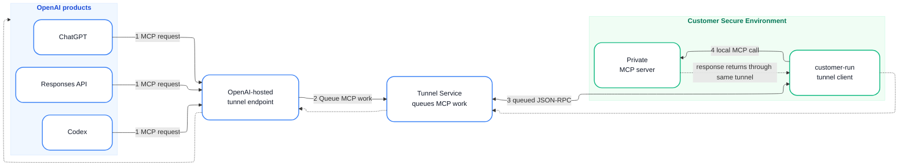

# Example 1: Secure MCP Tunnel（复刻参考图）

> 用户直接输入："画一个 OpenAI 安全 MCP Tunnel 生命周期：OpenAI 产品 → endpoint → Tunnel Service → customer client → Private MCP server，响应沿同一隧道返回。"

## Mermaid 代码



## 渲染命令

```bash
bash ~/.workbuddy/skills/flowchart-generator/scripts/render.sh \
  --input secure-mcp-tunnel.mmd \
  --output secure-mcp-tunnel.png \
  --width 2600
```

## 设计要点

- **ELK 布局器**：保证 OpenAI 组、中间节点、Customer 组水平排列
- **白底节点 + 彩色边框**：OpenAI 蓝 / 客户绿，符合参考图
- **浅色分组背景**：OpenAI `#F0F7FF`，Customer `#F0FDF4`
- **圆形数字徽章**：`<span class='badge'>` 由 CSS 渲染为蓝底白字圆
- **虚线返回路径**：绿色文字 + 绿色虚线
