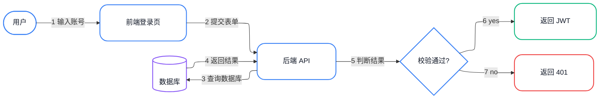

# Example 2: 自然语言 → 登录流程

> 用户输入："画一个用户登录流程：用户输入用户名密码 → 提交到后端 → 后端查数据库 → 校验成功就生成 JWT 返回前端，失败就返回 401 + 错误提示。"

## LLM 翻译后的 Mermaid



## 渲染命令

```bash
bash ~/.workbuddy/skills/flowchart-generator/scripts/render.sh \
  --input login-flow.mmd \
  --output login-flow.png \
  --width 2200
```

## 设计要点

- 蓝色：系统组件
- 绿色：成功分支
- 红色：失败分支
- 紫色：数据存储（数据库）
- 数字 1-7 标记主流程
- 菱形节点表示判断
