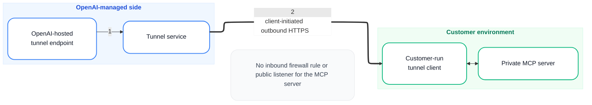

# Example 3: Trust Boundary（信任边界）

> 用户直接输入："画一个 OpenAI 安全隧道信任边界：OpenAI 管理侧包含 endpoint 和 tunnel service，客户环境包含 tunnel client 和 private MCP server。连接是 client-initiated outbound HTTPS，底部说明没有入站防火墙规则。"

## Mermaid 代码



## 渲染命令

```bash
bash ~/.workbuddy/skills/flowchart-generator/scripts/render.sh \
  --input trust-boundary.mmd \
  --output trust-boundary.png \
  --width 2200
```

## 设计要点

- **容器合理 padding**：`padding: 30, nodeSpacing: 60`，让分组标题和节点都不贴边，同时不过度撑大空白
- **长边标签远离容器**：用 `<span style='display:inline-block;padding-right:40px;...'>` 把文字往左侧推，避免贴到右侧容器
- **底部说明**：用普通节点 + 不可见边固定在两组中间下方
