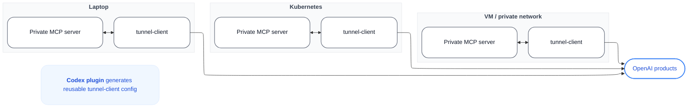

# Example 4: Same loop in three environments

> 用户直接输入："画一个三列环境对比图：Laptop、Kubernetes、VM / private network，每个环境里都有 Private MCP server 和 tunnel-client，三者都连到 OpenAI products。底部还有一个 Codex plugin 说明节点。"

## Mermaid 代码



## 渲染命令

```bash
bash ~/.workbuddy/skills/flowchart-generator/scripts/render.sh \
  --input three-environments.mmd \
  --output three-environments.png \
  --width 2400
```

## 设计要点

- **三列环境**：每个环境一个 `subgraph`，方向 `TB`
- **不可见边保持水平顺序**：`C1 ~~~ C2 ~~~ C3`
- **统一顶部说明节点**：用浅蓝背景节点放在底部说明文案
