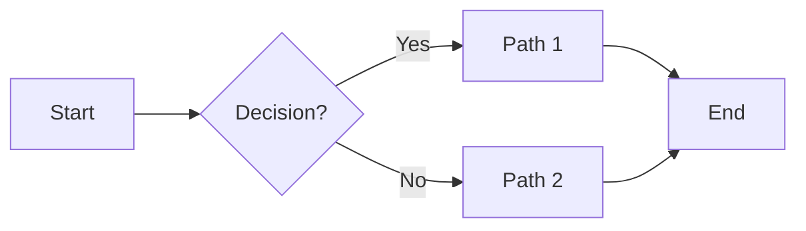
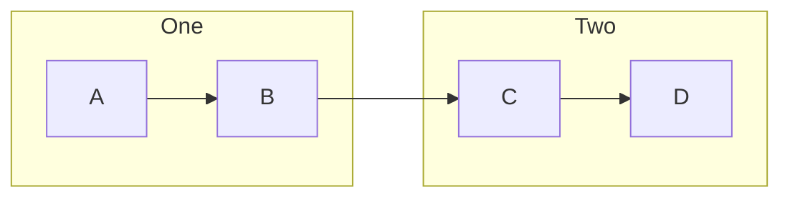
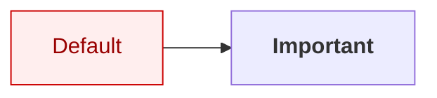
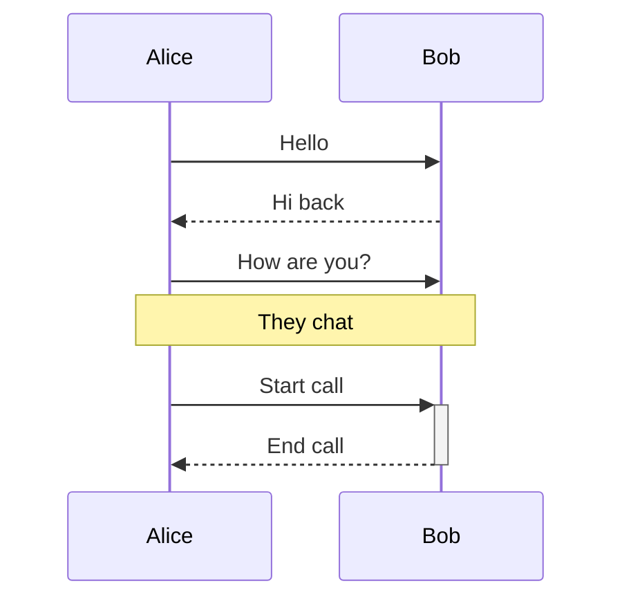
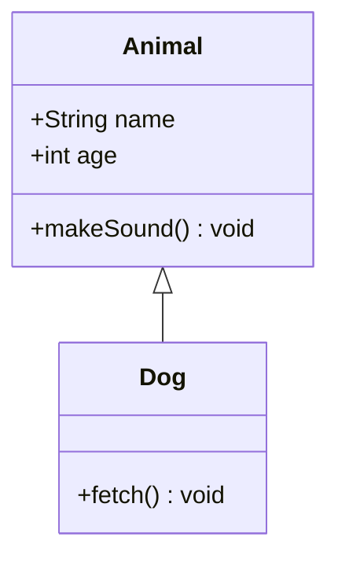
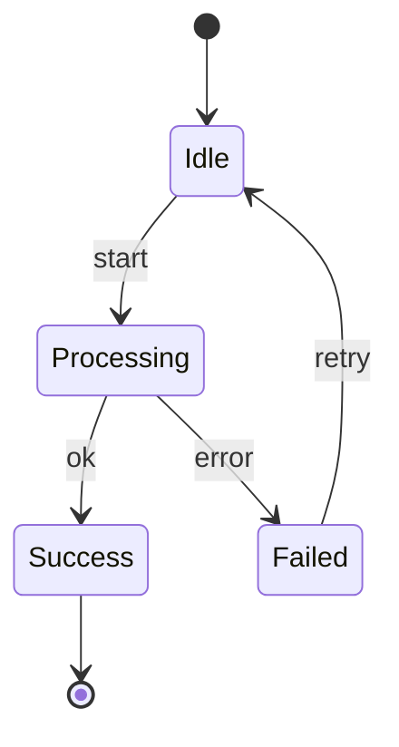
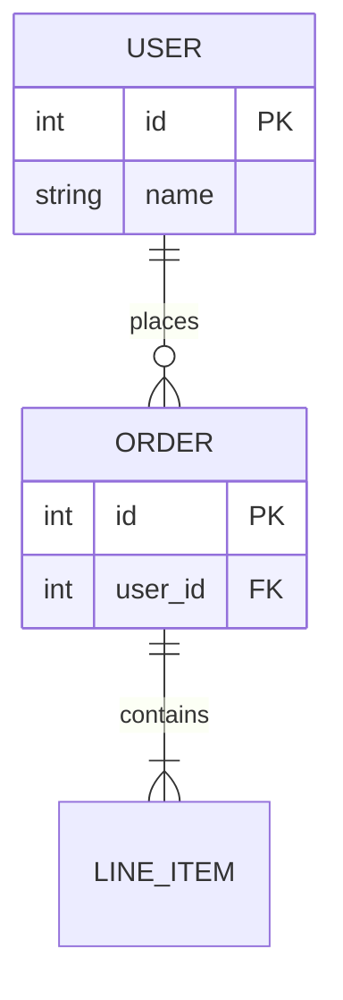
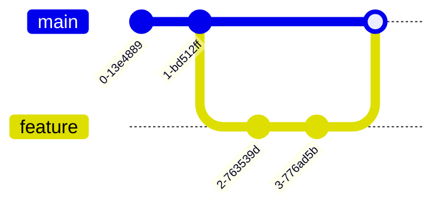
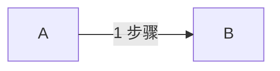

# Mermaid 速查表

> 详细语法参考 [mermaid.js.org](https://mermaid.js.org/)，这里只列最常用的部分。

## flowchart（流程图）



### 方向

- `LR` — 左到右（最常用）
- `RL` — 右到左
- `TB` / `TD` — 上到下
- `BT` — 下到上

### 节点

```mermaid
A[矩形]
B(圆角)
C([胶囊])
D[(圆柱/数据库)]
E{菱形/判断}
F{{六边形}}
G[/平行四边形/]
H((圆形))
I(((双重圆)))
J>文档形]
```

### 边

```
A --> B           实线箭头
A --- B           实线无箭头
A -.-> B          虚线箭头
A ==> B           加粗实线
A ~~~ B           不可见边（用于布局）
A -->|label| B    带文字
A -- text --> B   文字在中间
A <--> B          双向
A --o B           圆头
A --x B           叉头
```

### 子图



### 样式



### HTML 标签

节点内可放 HTML：
```mermaid
A["<b>Bold</b><br/>line 2"]
```

> `flowchart` 才支持完整 HTML；`graph` 旧版不支持。

---

## sequenceDiagram（时序图）



箭头类型：
- `->` 实线
- `-->` 虚线
- `->>` 实线箭头
- `-->>` 虚线箭头
- `-x` 失败
- `-)` 异步

---

## classDiagram（类图）



关系：
- `<|--` 继承
- `*--` 组合
- `o--` 聚合
- `-->` 关联
- `..>` 依赖
- `..|>` 实现

---

## stateDiagram-v2（状态机）



---

## erDiagram（实体关系）



关系：
- `||--||` 一对一
- `||--o{` 一对多
- `}o--o{` 多对多

---

## gitGraph（Git 提交图）



---

## 本 Skill 推荐写法

为了匹配 OpenAI 参考图风格，推荐在 flowchart 开头加 ELK 渲染器，并用 CSS class 徽章：



- `defaultRenderer: elk` — 子图水平排列更整齐
- `<span class='badge'>N</span>` — 由 `render.sh` 自动注入 inline style，渲染成圆形数字徽章

## 常用主题

mmdc 支持 4 个内置主题：`default`、`forest`、`dark`、`neutral`。本 Skill 默认用 `default`（白底）。
