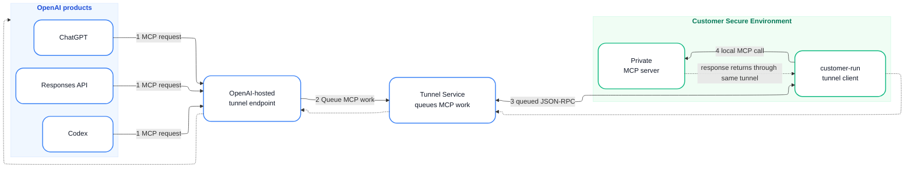

# Mermaid 视觉风格指南 — 靠近 OpenAI 参考图

本 Skill 用 `flowchart + ELK 布局 + 自定义 CSS` 逼近参考图：白色节点、柔和边框、浅色分组背景、圆形数字徽章、蓝/绿双色箭头。

> 重要：Mermaid 的渲染能力有硬上限。参考图里的「背景装饰圆圈」、手绘质感、每个箭头的小圆徽章等**无法 100% 复刻**。目前这套方案能到 **85% ~ 90%** 相似度，且渲染稳定、可维护。

---

## 1. 核心设计决策

| 元素 | 做法 | 原因 |
|------|------|------|
| 布局引擎 | `%%{init: {'flowchart': {'defaultRenderer': 'elk'}} }%%` | 让子图（subgraph）按水平顺序排列，避免默认 dagre 把子图压扁/堆叠 |
| 容器 padding | `padding: 30` | 让分组标题和内部节点有基本呼吸空间，不过度撑大空白 |
| 节点填充 | 白色 | 参考图节点都是白底，靠分组背景区分阵营 |
| 节点边框 | 蓝色 `#3B82F6` / 绿色 `#10B981` | 区分 OpenAI 侧和客户侧 |
| 分组背景 | 极浅蓝 `#F0F7FF` / 极浅绿 `#F0FDF4` | 模拟参考图里的淡色背景框 |
| 数字徽章 | `<span class='badge'>N</span>` | 由 `flowchart-theme.css` 渲染成蓝底白字圆，最接近参考图 |
| 箭头颜色 | 实线蓝 `#3B82F6`，虚线绿 `#10B981` | 主流程 vs 返回/次要路径 |
| 字体 | system-ui 系列 | 更接近参考图的干净无衬线字体 |

---

## 2. 必须写的头部

每张图开头固定这样写：

```mermaid
%%{init: {'flowchart': {'defaultRenderer': 'elk', 'padding': 30, 'nodeSpacing': 60}}}%%
flowchart LR
```

然后立刻写 classDef：

```mermaid
classDef oaNode fill:#ffffff,stroke:#3B82F6,stroke-width:2px,color:#111827,rx:18,ry:18
classDef cuNode fill:#ffffff,stroke:#10B981,stroke-width:2px,color:#111827,rx:18,ry:18
```

---

## 3. 子图（分组）写法

子图标题在 title 里用 `<b>` 加粗，颜色用 `style` 命令单独设置：

```mermaid
subgraph OA["<b>OpenAI products</b>"]
    direction TB
    P1["ChatGPT"]:::oaNode
    P2["Codex"]:::oaNode
end
style OA fill:#F0F7FF,stroke:#DBEAFE,stroke-width:1px,color:#1D4ED8

subgraph CU["<b>Customer Secure Environment</b>"]
    direction TB
    C["customer-run tunnel client"]:::cuNode
    D["Private MCP server"]:::cuNode
end
style CU fill:#F0FDF4,stroke:#D1FAE5,stroke-width:1px,color:#047857
```

> **注意**：`classDef` 对 subgraph 本身通常不生效，所以分组颜色必须用 `style` 命令。
> **注意 2**：subgraph 的 id 用英文，中文放在 title 里。id 不能是保留字（如 `end`）。

---

## 4. 强制水平顺序：用 `~~~` 不可见边

默认布局会把子图压到一起。用不可见边固定顺序：

```mermaid
OA ~~~ E ~~~ TS ~~~ CU
```

然后再画真正的带标签边：

```mermaid
P1 & P2 -->|"<span class='badge'>1</span> request"| E
E -->|"<span class='badge'>2</span> work"| TS
```

这样整体图会按 `OA → E → TS → CU` 排成一条水平线。

---

## 5. 数字徽章（核心）

不要写内联 `style` 了，统一用 CSS class：

```mermaid
A -->|"<span class='badge'>1</span> MCP request"| B
```

渲染时 `render.sh` 会自动注入 `scripts/flowchart-theme.css`，把 `.badge` 渲染成：
- 蓝底 `#3B82F6`
- 白字
- 圆形
- 20×20 px

如果返回路径需要绿色徽章，用：

```mermaid
A -->|"<span class='badge-green'>5</span> return"| B
```

---

## 6. 容器与边标签的 padding

### 6.1 子图内边距

推荐在 `init` 里设置较小的 `padding`，让子图内部紧凑但不贴边：

```mermaid
%%{init: {'flowchart': {'defaultRenderer': 'elk', 'padding': 30, 'nodeSpacing': 60}}}%%
flowchart LR
```

- 普通流程图：`padding: 30` + `nodeSpacing: 60`
- 含信任边界的架构图：同样 `padding: 30`，不要刻意加大

`render.sh` 的预处理脚本会自动给子图标题加 `padding-top: 4px`，只让标题和顶边框稍微分开，不会让标题和下方节点产生过大空白。

### 6.2 长边标签不要贴容器

如果某条边标签文字很长，容易贴到右侧容器上。把文字包在一个 inline-block 里，右侧加 padding：

```mermaid
TS ==>|"<span class='badge'>2</span><span style='display:inline-block;padding-right:40px;background:rgb(255,255,255);'>client-initiated outbound HTTPS</span>"| TC
```

- `padding-right:40px` 把文字往标签框左侧推，远离右侧容器
- `background:rgb(255,255,255)` 保证标签背景纯白，不会透出默认灰底

---

## 7. 返回 / 次要路径

返回路径用虚线，文字用 `.return-text` 使其变绿：

```mermaid
D -. "<span class='return-text'>response returns through same tunnel</span>" .-> C
C -.-> TS
TS -.-> E
E -.-> OA
```

也可以只用一条带标签的虚线返回：

```mermaid
D -. "<span class='return-text'>response returns</span>" .-> TS
```

---

## 7. 颜色速查

| 用途 | 色值 | 说明 |
|------|------|------|
| OpenAI 节点边框 | `#3B82F6` | 节点白底、蓝边框 |
| 客户节点边框 | `#10B981` | 节点白底、绿边框 |
| OpenAI 分组背景 | `#F0F7FF` | 很淡的蓝色 |
| 客户分组背景 | `#F0FDF4` | 很淡的绿色 |
| 分组边框 | `#DBEAFE` / `#D1FAE5` | 比分组背景稍深 |
| 分组标题 | `#1D4ED8` / `#047857` | 深蓝/深绿 |
| 节点文字 | `#111827` | 近黑 |
| 边文字 | `#374151` | 深灰 |
| 主箭头 | `#3B82F6` | 蓝色实线 |
| 返回箭头 | `#10B981` | 绿色虚线 |
| 徽章蓝 | `#3B82F6` | 步骤 1/2/3/4... |
| 徽章绿 | `#10B981` | 返回步骤 |

---

## 8. 完整示例（Secure MCP Tunnel）



渲染命令：

```bash
bash ~/.workbuddy/skills/flowchart-generator/scripts/render.sh \
  --input secure-mcp-tunnel.mmd \
  --output secure-mcp-tunnel.png \
  --width 2600
```

---

## 9. 已知限制（与参考图仍有差距）

1. **返回箭头头部颜色**：由于 Mermaid 所有箭头复用同一个 marker，返回虚线箭头的头部目前也是蓝色，不能完全变成绿色。
2. **背景装饰圆圈**：参考图有非常淡的圆形背景装饰，Mermaid 无法原生生成，需要后处理 SVG。
3. **节点阴影**：参考图有更柔和的投影，当前 CSS 仅加了轻微 drop-shadow。
4. **胶囊形节点**：参考图节点比 Mermaid 的 `rx:18` 更圆，但 `rx:18` 已是较优折中。
5. **双线箭头**：`TS <--> C` 在 Mermaid 中不是双线条，而是双向箭头。参考图第 3 步更像双头单线。

如果追求像素级还原，建议改用 **D2** 或 **Excalidraw** 渲染引擎（可另行扩展本 Skill）。
