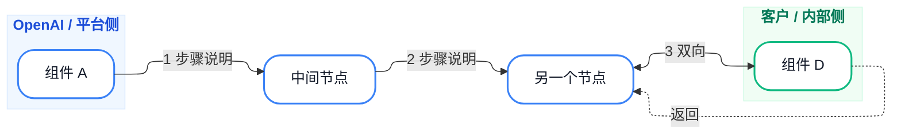
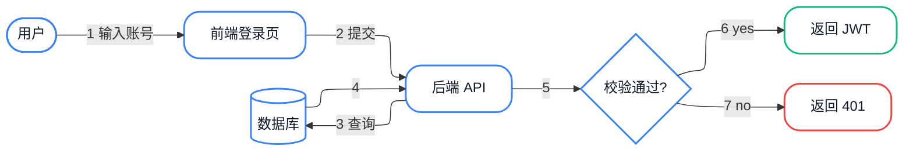

# LLM 提示指南：自然语言 → Mermaid

这份文件是给 LLM 看的。当用户输入自然语言描述时，LLM 按本文档把它翻译成 Mermaid 代码。

---

## 1. 判断输入类型

| 用户描述关键词 | Mermaid 类型 |
|---------------|-------------|
| 步骤、判断、分支、A→B | `flowchart` |
| A 发送消息给 B、调用、请求 | `sequenceDiagram` |
| 类、对象、字段、方法 | `classDiagram` |
| 状态、转移、事件 | `stateDiagram-v2` |
| 表、外键、关系 | `erDiagram` |
| 分支、合并、版本 | `gitGraph` |

默认用 `flowchart LR`。除非用户明确说要时序图/类图/ER图等，否则都用 flowchart。

---

## 2. 翻译步骤

1. **提取实体**：角色/组件/对象
2. **提取关系**：实线、虚线、双向、返回
3. **提取方向**：水平（LR）还是垂直（TB）
4. **分组**：是否有 OpenAI/客户、内/外、模块等需要 subgraph
5. **配色**：根据语义给两侧分别分配蓝/绿 class
6. **编号**：按主流程顺序在 edge label 里加 `<span class='badge'>N</span>`

---

## 3. 强制规则（违反会渲染失败或效果差）

### 3.1 开头必须是 flowchart + ELK

```mermaid
%%{init: {'flowchart': {'defaultRenderer': 'elk'}} }%%
flowchart LR
```

ELK 布局器对子图的水平排列至关重要，不要省略。

### 3.2 节点 ID 用英文，title 用中文

```mermaid
user["用户"]      ✅
用户["用户"]      ❌ 容易踩坑
```

### 3.3 长文字用 `<br/>` 换行

```mermaid
E["OpenAI-hosted<br/>tunnel endpoint"]
```

### 3.4 保留字不能当 ID

`end` `subgraph` `class` `style` 是保留字，不要当节点 ID。

### 3.5 子图颜色用 `style` 命令，不要用 classDef

```mermaid
subgraph OA["OpenAI products"]
  ...
end
style OA fill:#F0F7FF,stroke:#DBEAFE,stroke-width:1px,color:#1D4ED8
```

### 3.6 强制水平顺序用 `~~~` 不可见边

```mermaid
OpenAI ~~~ E ~~~ TS ~~~ Customer
```

### 3.7 数字徽章用 CSS class

```mermaid
A -->|"<span class='badge'>1</span> 请求"| B
```

不要写内联 `style`。

### 3.8 返回路径用绿色文字 class

```mermaid
B -. "<span class='return-text'>返回</span>" .-> A
```

---

## 4. 标准模板



---

## 5. 输出格式

LLM 输出 Mermaid 时：

1. 包在 ` ```mermaid ... ``` ` 代码块里
2. 紧跟一句简短说明：用了什么风格、关键步骤
3. 提醒用户：可以调整布局/颜色/文字

---

## 6. 示例

**用户输入**：
> 用户登录流程：用户输入用户名密码 → 提交到后端 → 后端查数据库 → 校验成功返回 JWT，失败返回 401。

**LLM 输出**：



说明：用蓝色表示系统组件，绿色/红色分别表示成功/失败分支，菱形表示判断。
