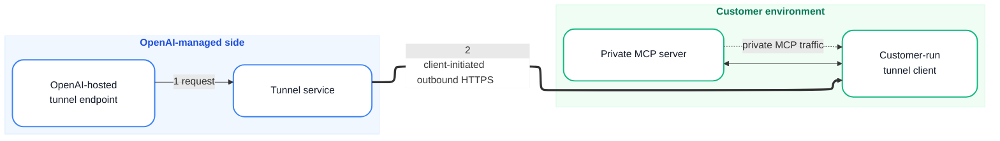

# Template: 架构图 / 信任边界

适合「两侧/两环境对比」的图，比如 OpenAI 平台侧 vs 客户环境、DMZ vs 内网等。



**渲染**：

```bash
bash ~/.workbuddy/skills/flowchart-generator/scripts/render.sh \
  --input architecture.mmd \
  --output architecture.png \
  --width 2000
```

**调整**：
- 改分组标题：改 `subgraph` 的 title 字符串
- 改分组方向：`direction TB` / `direction LR`
- 中间加节点：在 `OA ~~~` 链里插入
