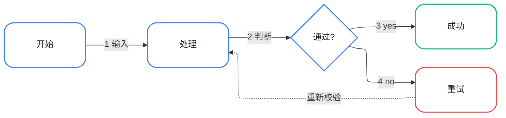

# Template: 水平流程图

适合有明确顺序的步骤流程（A → B → C → D）。



**渲染**：

```bash
bash ~/.workbuddy/skills/flowchart-generator/scripts/render.sh \
  --input horizontal-flow.mmd \
  --output horizontal-flow.png \
  --width 1800
```

**调整**：
- 增加步骤：复制一行 `-->|"<span class='badge'>N</span> ..."|-->`
- 改变方向：`flowchart LR` → `flowchart TB`
- 增加分支：在菱形节点后加多个箭头
