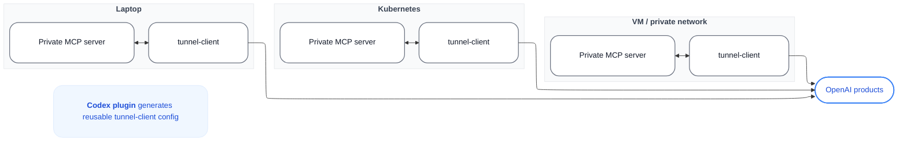

# Template: 三列并排

适合展示「同一份逻辑在 3 个环境同时运行」的图（参考 OpenAI 的 "Same local loop, anywhere"）。



**渲染**：

```bash
bash ~/.workbuddy/skills/flowchart-generator/scripts/render.sh \
  --input three-columns.mmd \
  --output three-columns.png \
  --width 2200
```

**调整**：
- 增减列：复制/删除整个 `subgraph` 块
- 顶部/底部说明：改 `TOP` 节点的文字
